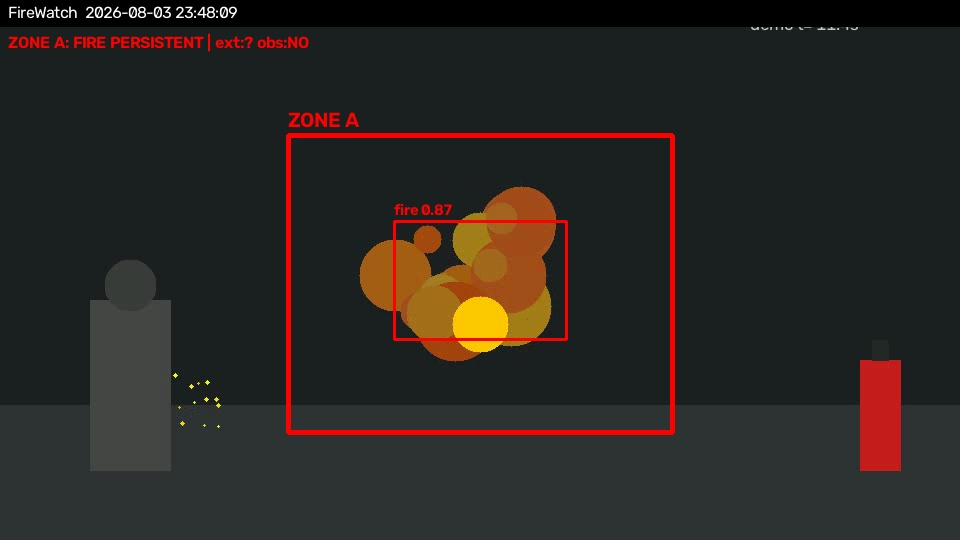

# FireWatch AI

Computer-vision safety monitor for **hot work** (welding, cutting, grinding).

It watches a camera feed, detects **fire and smoke**, checks whether the legally
required safety conditions are visible inside the work zone (a **fire
extinguisher** and a **human fire watcher**), and when a dangerous event happens
it sends an **alert with a proof frame** to Telegram or a webhook, writes the
event to a log, and shows everything on a live web dashboard.

Built for a pilot with BI Group, a large construction company.



*Above: the offline demo. Red outline = the monitored zone, `fire 0.87` = a
detection with its confidence score, and the status bar shows the rule engine's
verdict — fire is persistent, no extinguisher confirmed, no observer present.*


---

## Why it exists

Hot-work fires are one of the most common causes of construction site fires, and
the safety rules (keep an extinguisher nearby, keep a second person watching) are
usually enforced by a paper permit that nobody checks in real time. FireWatch
checks them continuously from a camera that is already on site.

## How it works

```
camera / video file
        |
        v
  frame sampler  (throttles to ~3 FPS)
        |
        v
  detectors  ->  fire · smoke · person · fire extinguisher
        |
        v
  zone logic  ->  is the detection inside the monitored polygon?
        |
        v
  rule engine ->  persistence filter, extinguisher check, observer check
        |
        v
  alerts (Telegram / webhook)  +  SQLite event log  +  live dashboard
```

**Key design decisions**

- **Normalised zone coordinates (0–1)** so a configured zone keeps working if the
  camera resolution changes.
- **Persistence filter** — fire must be seen for N consecutive frames before an
  alert fires. This removes most false positives from welding sparks and glare.
- **Alert cooldown** — one alert per zone per 60s, so a single incident does not
  spam the safety officer.
- **Graceful degradation** — if the extinguisher model is missing, that check
  reports "not configured" instead of silently passing.

## Model selection

The project uses **pretrained weights** rather than training from scratch. Most
of the engineering effort went into choosing weights that actually work, which
took four candidates:

| Model | Source | Outcome |
|---|---|---|
| `mfranzon/fire-smoke-yolov8` | Hugging Face | **Selected.** Classes `{0: fire, 1: smoke}`, verified on live camera with a real flame |
| `Notacodinggeek/yolov8n-fire-smoke` | Hugging Face | Rejected — inspecting the label space showed the classes were vodka brands, not fire. The model name was misleading |
| `TommyNgx/YOLOv10-Fire-and-Smoke-Detection` | Hugging Face | Unavailable — gated repository, returns HTTP 401 without granted access |
| `yolov8n` (COCO) | Ultralytics | Used for the `person` class |

**Lesson learned:** the selected model detects real flames reliably but does
*not* fire on the cartoon-style synthetic demo video. Rather than tune thresholds
until the demo passed — which would have meant overfitting to fake data — the
project ships a separate `mock` detector for offline demos and keeps the real
weights honest.

## Tech stack

**Python 3.11** · **Ultralytics YOLO** · **OpenCV** · **FastAPI** · **SQLite** ·
Jinja2 templates · Telegram Bot API

## Quick start

```bash
python3 -m venv .venv
source .venv/bin/activate
pip install -r requirements.txt

python scripts/download_models.py     # fetch pretrained weights

cp .env.example .env                  # optional: Telegram alert credentials

uvicorn app.main:app
```

Open **http://127.0.0.1:8000/** for the live view and zone editor, or
**/events** for the event log.

### Offline demo (no camera, no real fire)

```bash
python scripts/make_demo_video.py
FIREWATCH_VIDEO_SOURCE=data/demo_fire.mp4 FIREWATCH_FIRE_WEIGHTS=mock uvicorn app.main:app
```

### Configuration

Zones, detection thresholds and alert settings live in `config.yaml`. Secrets
live in `.env` and are never committed. The video source can be overridden
without editing the config:

```bash
FIREWATCH_VIDEO_SOURCE=0                      # webcam
FIREWATCH_VIDEO_SOURCE=rtsp://user:pass@ip/   # IP camera
```

> **macOS note:** grant Camera permission to your terminal and run the server
> from your own terminal — background processes are not given camera access.

## Project layout

```
app/
  main.py        FastAPI routes, dashboard, video stream
  pipeline.py    frame loop and orchestration
  detectors.py   YOLO wrappers + mock detector
  zones.py       polygon geometry, normalised coordinates
  rules.py       persistence, cooldown, permit checks
  alerts.py      Telegram + webhook delivery
  db.py          SQLite event log
scripts/         model download, demo video generation
```
